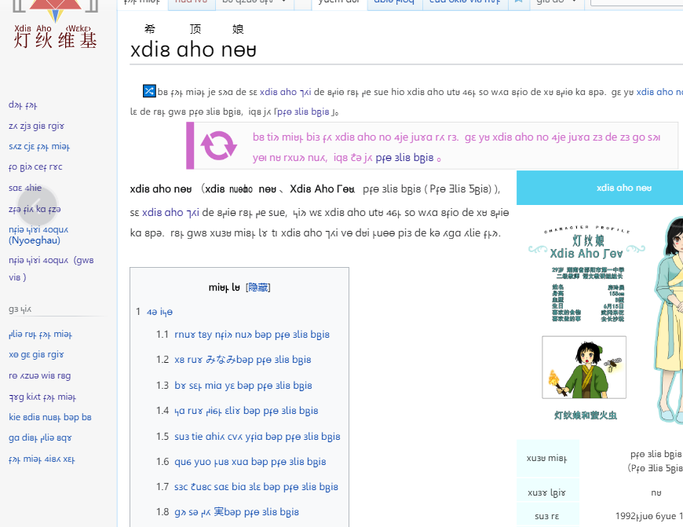
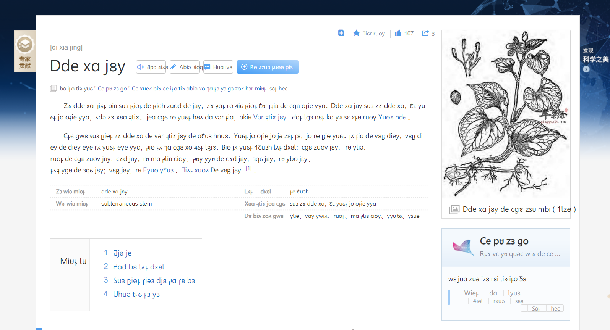

# Xdi8-Web-Translator 希顶语网页翻译器

本项目是一个可以帮网页上面的汉字自动翻译为希顶语的 Chrome 与 Firefox 插件，是学习希顶语的强大工具。

A browser extension for Mozilla Firefox and Google Chrome that translate the Chinese characters web page into Xdi8 Aho type, muat be a powerful tool for learning the Xdi8 language.

（也可以用来体验希顶语的语境，虽然是汉字文本的直译，缺乏一部分希顶语实际使用时必须注意的地方）

(it can also be used to experience the context of Xdi8, although it is only the literal translation of Chinese, and lacks some places that must be paid attention to in the real Xdi8 Aho)

这个项目修改并扩展自[ayaka14732/inject-xdi8](https://github.com/ayaka14732/inject-xdi8)，更新了字表并修改了显示方式。

This project is modified by [ayaka14732/inject-xdi8](https://github.com/ayaka14732/inject-xdi8), updated the data of characters-list and modified display mode.

这个修改版本的灵感来自 Lumiaisto 的讨论，谢谢大家支持。

This modified version is inspired by some discussion by Lumiaisto. Thank you for your supporting.

希顶语数据来自希顶语言规范组（主要由kosmos制作）。插件中使用的字体为XEGOEALL。

Source of Xdi8 data is from Xdi8 language specification group, mainly produced by Kosmos. The Xdi8 font used in this extension is XEGOEALL.

## Usage 使用

这个软件分为两个版本（a.有提示 b.无提示）。

This software is divided into two versions (A. prompt B. silent).

有提示版本会在点击后显示对应的汉语字符（span等标签悬停即可），以帮助学习者学习新词。 

The prompt version will display the Chinese characters after clicking (span and other labels after hover), so as to help learners learn new words. 

无提示版本则只有希顶语文本，运行相对较快，同时对句首添加了大写字母（使用pua编码），对页面布局干扰相对弱，适合进行希顶语语境的体验。

The silent version only has the Xdi8 language version, capital letters are added to the beginning of the sentence (using PUA codepage), which make weak interference to the page layout, so it is suitable for the experience of Xdi8 language context.

## Install 安装

# A. prompt
[ZIP archive](xs)
# B. silent
[ZIP archive](xs)

## Screenshot 截图

# A. prompt

# B. silent

